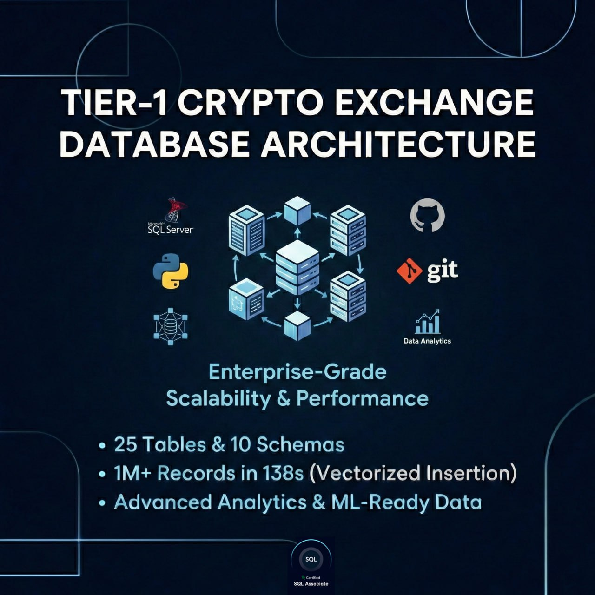
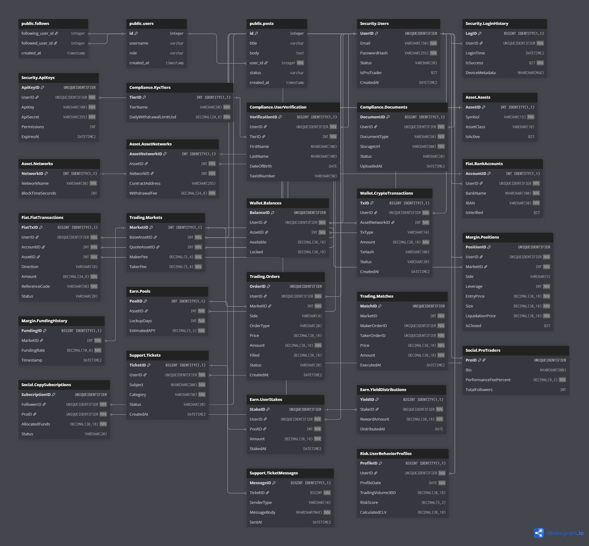

<div align="center">
  
  

  <br><br>

  
  
  
  
  
  <h1>🏛️ Tier-1 Crypto Exchange Database Architecture & Data Pipeline</h1>
  
  <p><b>Enterprise-grade database design, high-frequency trading simulation, and advanced data analytics.</b></p>

</div>

<hr>

## 📌 Project Overview

This project showcases an enterprise-grade, highly normalized relational database architecture designed for a **Tier-1 Cryptocurrency Exchange**. Moving beyond simple CRUD operations, it implements complex financial systems, including Hot/Cold wallets, Staking (Earn), Copy Trading, and Margin/Futures ledgers.

To prove the architecture's scalability and robustness, a high-performance Python data generation pipeline was built. Utilizing **Vectorization (Pandas/NumPy)** and `fast_executemany`, the system successfully inserts **1,000,000+ relational records in just 138 seconds** (~7,500 inserts/sec).

---

## 🏗️ System Architecture (25 Tables | 10 Schemas)

The database is logically partitioned into 10 distinct schemas to simulate microservices and isolate business logic.

<details>
  <summary><b>🔐 Security & Compliance (Click to expand)</b></summary>
  <ul>
    <li><code>[Security]</code>: Manages core identities, API keys with bitwise permissions, and JSON-based login fingerprinting for fraud detection.</li>
    <li><code>[Compliance]</code>: Handles KYC tiers, document verification, and daily withdrawal limits.</li>
  </ul>
</details>

<details>
  <summary><b>💼 Asset & Wallet Management (Click to expand)</b></summary>
  <ul>
    <li><code>[Asset]</code>: Central repository for Fiat and Crypto assets, mapping them to specific blockchain networks.</li>
    <li><code>[Wallet] & [Fiat]</code>: Manages Bank Accounts, Crypto deposits/withdrawals, and crucially separates <b>Available</b> vs. <b>Locked</b> balances to prevent double-spending.</li>
  </ul>
</details>

<details>
  <summary><b>📈 Trading & Margin Engine (Click to expand)</b></summary>
  <ul>
    <li><code>[Trading]</code>: High-Frequency Trading (HFT) order books handling MARKET, LIMIT, and STOP orders, alongside a partitioned matching engine.</li>
    <li><code>[Margin]</code>: Isolated/Cross margin tracking, leverage up to 125x, and liquidation triggers.</li>
  </ul>
</details>

<details>
  <summary><b>🌐 Social & Earn Ecosystem (Click to expand)</b></summary>
  <ul>
    <li><code>[Social]</code>: Copy-trading mechanisms connecting Pro Traders with follower subscriptions and performance fee calculations.</li>
    <li><code>[Earn]</code>: Staking pools, user stakes, and daily yield distributions (APY).</li>
  </ul>
</details>

<details>
  <summary><b>🛡️ Risk & Support (Click to expand)</b></summary>
  <ul>
    <li><code>[Support]</code>: Internal CRM for ticketing and agent-user communication.</li>
    <li><code>[Risk]</code>: Daily balance snapshots and ML-ready <b>User Behavior Profiles</b>, serving as a data warehouse for Churn prediction and CLV (Customer Lifetime Value) modeling.</li>
  </ul>
</details>

<br>

<div align="center">
  <h3>📊 Entity-Relationship Diagram (ERD)</h3>
  
</div>

---

## 🚀 The Data Pipeline: 1M+ Records in 138s

A major highlight of this repository is the data generation script (`2_Data_Generation/vectorized_insert.py`). Instead of traditional `for` loops, it is optimized for Big Data workflows:

* **Statistical Realism:** Uses `NumPy` distributions (Lognormal for wealth, Exponential for trade volumes) to mimic real-world financial data.
* **Vectorization:** Relies entirely on `Pandas` for vectorized dataframe construction, eliminating Python-level iteration overhead.
* **Bulk Execution:** Employs `SQLAlchemy` with `fast_executemany=True` directly pushing data to SQL Server.

---

## 🔬 Advanced Analytics (T-SQL)

The `3_Analytical_Queries` directory contains complex SQL scripts demonstrating advanced data extraction:

* **Whale Market Share Analysis:** Utilizes `CTEs` and advanced Window Functions (`RANK()`, `SUM() OVER()`) to identify top traders and calculate their exact market dominance without the performance hit of subqueries.

---

## ⚙️ How to Run Locally

### Prerequisites
* SQL Server Management Studio (SSMS)
* Python 3.9+

### Steps
1.  **Clone the Repository**
    ```bash
    git clone https://github.com/SeyyedSajjadFazeli/Tier1-CryptoExchange-DB-Architecture.git
    cd Tier1-CryptoExchange-DB-Architecture
    ```
2.  **Deploy Database:** Execute `1_SQL_Architecture/01_MegaExchange_Schema.sql` in SSMS. (Ensure you run the Seed Data section at the bottom).
3.  **Install Python Dependencies:**
    ```bash
    pip install -r requirements.txt
    ```
4.  **Generate Big Data:** Update the `server` variable in `vectorized_insert.py` with your SQL Server instance name, then run:
    ```bash
    python 2_Data_Generation/vectorized_insert.py
    ```

---

<div align="center">
  <h3>👨‍💻 Author</h3>
  <b>Sajjad Fazeli</b><br>
  <i>Data Analysis Engineer</i><br><br>
  <a href="https://www.linkedin.com/in/seyyed-sajjad-fazeli-a58aa1360?lipi=urn%3Ali%3Apage%3Ad_flagship3_profile_view_base_contact_details%3BbtceppQsSNyU%2FpK6M01E9Q%3D%3D">
    
  </a>
  <a href="https://github.com/SeyyedSajjadFazeli">
    
  </a>
</div>
